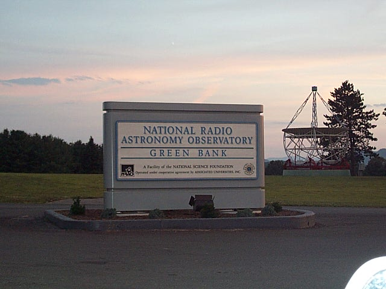
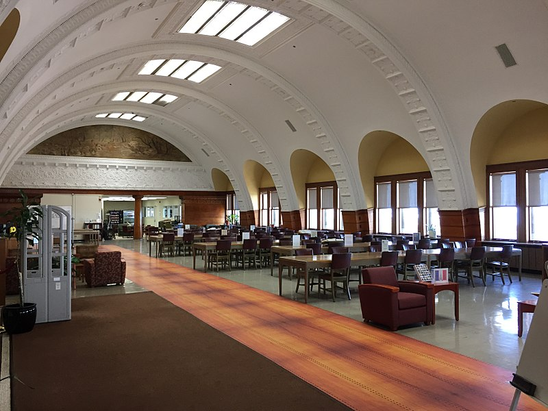

---?image=assets/img/background.png
@title[Hack The Universe]

@snap[north-west span-100 text-20 text-bold text-center text-yellow]
Hack the Universe
@snapend

@snap[west span-100 text-center text-yellow]
Amateur Radio Astronomy
@snapend

---?image=assets/img/black_and_blue.jpeg
@title[Bio]

@snap[west]

@snapend

@snap[north-east span-45 text-08]
@box[text-yellow](Current Work#Consulting Engineer at Palo Alto Networks)
@snapend

@snap[east span-45 text-06]
@box[text-yellow](Previous Work#- Motorola - R&D Eng at Nokia Siemens - SecDataSci [@SecureCloudDev](https://twitter.com/SecureCloudDev))
@snapend

@snap[south-east span-45 text-08]
@box[text-yellow](Education#- MS DePaul University - MS Northwestern - BS in Comp Sci)
@snapend

Note:

- CE gets called in to assist SE's as a subject matter expert.
- Tech Lead in cellular base station product dev at Moto.
- Bought out by NSN
- Wound up at Salesforce doing security data science.
  - In-house log aggregation solution for sec logs
  - Our team used ML to deal with 1B security logs per day.
- MS in network eng, network security

---?image=assets/img/background.png
@title[Disclaimer]
@transition[zoom-in fade-out]

@snap[north-west span-80 text-20 text-bold text-yellow]
Disclaimer
@snapend

@snap[midpoint span-100 text-left text-06 text-yellow]
@ul[circles](false)

- I am not a physicist, cosmologist, chemist or other field related to RA.
- My work experience and degrees are all computer network/security related.
- My interest and experience with RA are purely amatuer/hobby related.
- Committed to a life of understanding to the extent possible.
- I do misspeak and make mistakes, there are many things I don’t know (but want to).
- The Otis (onus) for discretionary use of the information presented herein is your responsibility.
- Also I’m not a lawyer, so this disclaimer is invalid.

@ulend
@snapend

@snap[north-east]

@snapend

---?image=assets/img/black_and_blue.jpeg
@title[Introduction]

@snap[north-west span-100 text-20 text-bold text-center text-yellow]
Introduction
@snapend

@snap[south-west span-35 text-08]
@box[text-yellow](You can [follow along on GitPitch](https://github.com/hotpeppersec/hack_the_universe) if you like)
@snapend

@snap[south span-35 text-08]
@box[text-yellow](Please use ["issues" for feedback/error reporting](https://github.com/hotpeppersec/hack_the_universe/issues))
@snapend

@snap[south-east span-35 text-08]
@box[text-yellow](OK to interrupt w/questions [or send me a tweet](https://twitter.com/TheDevilsVoice))
@snapend

@snap[midpoint]
@img[span-80](assets/img/game_on.jpeg)
@snapend

Note:

- You can **follow along** with this talk on my github (hotpeppersec).
  - There are links throughout the presentation that you can click on for greater detail.
- I realize this presentation is currently a bit wonky when viewed on a mobile device.
  - I'm working on it, don't @ me.
- Please do provide feedback via "issues"
- My speaking style is fairly informal and if you stop me with a question I will do my best to answer it.
- [issues](https://github.com/hotpeppersec/shifting_left/issues)
- I will attempt to strike a balance begtween tactical and logistical concerns

---?image=assets/img/background.png
@title[What]

@snap[north-west span-100 text-20 text-bold text-left text-yellow]
What?
@snapend

@snap[west span-100 text-left text-07 text-yellow]
@ul[circles](false)

- Radio astronomy is the study of celestial objects that give off radio waves.
  - Often invisible or hidden in electromagnetic spectrum.
- Optical Astronomy has been around as long as people have been looking at the night sky.
  - RA is much newer.
  - RA is very technology driven.

@ulend
@snapend

@snap[east]

@snapend

Note:

- Anybody can do a science. No barrier to entry. You just go for it!

---?image=assets/img/black_and_blue.jpeg
@title[Spectrum]

@snap[north-west span-100 text-16 text-bold text-center text-yellow]
Electromagnetic Spectrum
@snapend

@snap[south]

@snapend

---?image=assets/img/background.png
@title[Ties]

@snap[north-west span-100 text-16 text-bold text-center text-yellow]
Ties to Hacker Culture
@snapend

@snap[west span-60 text-06 text-yellow]
@ul[circles](false)

- Depends on how you define “hacker”, but….
  - People driven to learn about or enhance usability of things
  - Coming up with novel and clever solutions to problems you didn’t know you had.
- RA folks have their own tribe, as do we.
  - Heavy involvement in Ham Radio
    - Interest in antennae, wave propagation, chemistry, physics.
    - Lots of opportunity to make your own antennae, receivers, etc.
  - People who work as scientists & engineers by day
  - People who run the planetariums & observatories
  - Maybe you and I?

@ulend
@snapend

@snap[east]
@img[span-65 bg-white](assets/img/Satellite-Hacker-main.jpeg)
@snapend

---?image=assets/img/background.png
@title[Why]

@snap[north-west span-100 text-16 text-bold text-center text-yellow]
Why is RA Important?
@snapend

@snap[west span-65 text-07 text-yellow]
@ul[circles](false)

- More than just a quest to see what’s out there.
- We don’t know what we don’t know.
- The BIG questions
  - Where did we come from?
  - What’s in store for us as a species?
- Complements optical astronomy.
  - Being able to “see” invisible gasses.
  - Detection of objects whose light is easily obscured by cosmic dust.
- Are there ways we can amass knowledge to enable technologies that will enhance and improve our lives?

@ulend
@snapend

@snap[east]
@img[bg-white](assets/img/sciens.png)
@snapend

---?image=assets/img/background.png
@title[Magnitude]

@snap[north-west span-100 text-16 text-bold text-center text-yellow]
Magnitude of Time and Space
@snapend

@snap[west span-75 text-left text-07 text-yellow]

- The shape/size of the universe is a factor of it’s density…
- “The simplest version of the inflationary theory, an extension of the Big Bang theory, predicts that the density of the universe is very close to the critical density, and that the geometry of the universe is flat, like a sheet of paper.”
- The scientific consensus is that we live in a flat, infinite universe.
  - [source](https://map.gsfc.nasa.gov/universe/uni_shape.html)

@snapend

@snap[east]

@snapend

Note:

- With RA you can bake your noodle with stuff like this.

---?image=assets/img/background.png
@title[Karl Guthe Jansky]

@snap[north-west span-100 text-16 text-bold text-center text-yellow]
Karl Guthe Jansky
@snapend

@snap[east]

@snapend

@snap[west span-70 text-left text-07 text-yellow]
@ul[circles](false)

- Karl Guthe Jansky
  - (October 22, 1905 – February 14, 1950)
- Considered a “founding figure” in RA
- First person to record radio signals from beyond Earth.
- Identified the source of “hiss” during long distance telephone calls as [coming from the center of our galaxy](https://public.nrao.edu/gallery/karl-jansky-with-his-milky-way-map/)

@snapend

Note:

- Later turned out to be a black hole in Sagittarius

---?image=assets/img/background.png
@title[Jansky Monument]

@snap[north-west span-100 text-16 text-bold text-center text-yellow]
Jansky Monument
@snapend

@snap[west span-50 text-08 text-yellow]

- Located in Holmdel, NJ
- Oriented as Jansky's antenna was at 7:10 p.m. on September 16, 1932, at a moment of maximum signal.

@snapend

@snap[east]

@snapend

Note:

- Neat monument.

---?image=assets/img/background.png
@title[Grote Reber]

@snap[north-west span-100 text-16 text-bold text-center text-yellow]
Grote Reber
@snapend

@snap[east span-70 text-left text-07 text-yellow]
@ul[circles](false)

- Grote Reber
  - (December 22, 1911 – December 20, 2002)
- He was an amateur and built his own equipment in his backyard in Wheaton, IL.
- Conducted the first sky survey at radio frequencies.

@snapend

@snap[west]

@snapend

---?image=assets/img/background.png
@title[The 21cm hydrogen Line]

@snap[north-west span-100 text-16 text-bold text-center text-yellow]
The 21cm hydrogen Line
@snapend

@snap[south-west span-35 text-07 text-yellow]
The spin of neutral hydrogen gives us an emission at 21cm wavelength
@snapend

@snap[south span-35 text-06 text-yellow]
This emission is more prevalent in the Universe and penetrates farther than visible light.
@snapend

@snap[south-east span-35 text-06 text-yellow]
Combined with WWII radar tech &  the advent of the transistor around 1945, RA research took off.
@snapend

@snap[midpoint]

@snapend

Note:

- update this
- [from here](https://www.cv.nrao.edu/course/astr534/HILine.html)

---?image=assets/img/background.png
@title[Interferometry]

@snap[north-west span-100 text-16 text-bold text-center text-yellow]
Interferometry Technique
@snapend

@snap[south-west span-35 text-07 text-yellow]
Simply put, physically linking or correlating data from two or more radio telescopes.
@snapend

@snap[south span-35 text-06 text-yellow]
Consider these dishes at the VLA in Socorro, NM.
@snapend

@snap[south-east span-35 text-06 text-yellow]
Spreading them out allows for a tighter focus on the desired observable area.
@snapend

---?image=assets/img/background.png
@title[Computing]

@snap[north-west span-120 text-11 text-bold text-yellow]
Interesting Computing Challenges Arise Quickly
@snapend

@snap[west span-70 text-left text-07 text-yellow]
@ul[circles](false)

- Sheer bulk of data coming in is challenging, esp w/ interferometry
- Post processing in a timely manner
- Correlation of Interferometric data can be challenging.
- Need for extreme clock precision and sync.
- A great use case for computational clusters.
- Storage and networking issues related to massive data sets.

@snapend

---?image=assets/img/background.png
@title[Trip to GB]

@snap[north span-100 text-center text-yellow]
SARA Conference at NRAO Green Bank, WV
@snapend

@snap[midpoint]

@snapend

Note:

- [https://public.nrao.edu/gallery/green-bank-observatory/](https://public.nrao.edu/gallery/green-bank-observatory/)

---?image=assets/img/background.png
@title[Main Bldg]

@snap[midpoint]

@snapend

@snap[south span-100 text-06 text-yellow]
So what does one do at a Radio Astronomy Conference?
@snapend

Note:

- We spent our days in this building, known as the Karl Janksy Laboratory.
- We listened to lectures from professional astronomers and physicists, and enjoyed presentations from the members of the club.

---?image=assets/img/background.png
@title[dorms]

@snap[midpoint]

@snapend

@snap[south span-100 text-06 text-yellow]
Dorm rooms & Cafeteria
@snapend

Note:

- In this picture, you can see the dormitories on the left and the cafeteria on the right. 
- You can also see the row of bicycles painted powder blue near the dorm entrance.
- These were provided as a courtesy and our main mode of transportation around the site!

---?image=assets/img/background.png
@title[dorms2]

@snap[midpoint]

@snapend

@snap[south span-100 text-06 text-yellow]
Frank Drake Lounge
@snapend

Note:

-On the second floor of the dormitories above the entrance, we have the Frank Drake lounge.
- Where you see a fireplace in this picture now, there used to be a chalk board where he introduced the now famous Drake Equation.
- This room also has a small kitchen and a library.

---?image=assets/img/background.png
@title[raffle]

@snap[south span-100 text-06 text-yellow]
Free Stuff!
@snapend

@snap[midpoint]

@snapend

Note:

- The Green Bank staff were extremely accommodating to our club.
- One nice thing they did was to turn over some of their older surplus equipment to our club for our projects!
- We drew names out of a hat to decide who got what.
- Here we see everyone perusing the boxes to see what they might grab in the raffle.

---?image=assets/img/background.png
@title[tour]

@snap[midpoint]

@snapend

@snap[south span-100 text-06 text-yellow]
Touring the facility
@snapend

Note:

- Part of the tour.
- Here we are listening to a talk by Gary Anderson on the calibration of the 327 mHz feed for the 100 meter Green Bank Telescope.

---?image=assets/img/background.png
@title[tour2]

@snap[midpoint]

@snapend

@snap[south span-100 text-06 text-yellow]
NRAO Green Bank is a [National Radio quiet zone](https://science.nrao.edu/facilities/gbt/interference-protection/nrqz/)
@snapend

Note:

- Radio Telescopes are extremely sensitive instruments.
- The spark plugs from the combustion engine in an automobile can be disruptive to the receivers that make up the "back end" of the scope.
- For this reason, cars are not allowed near the dishes. No rule against bicycles though!

---?image=assets/img/background.png
@title[diesel]

@snap[midpoint]

@snapend

@snap[south span-100 text-06 text-yellow]
Diesel fuel powered vehicles
@snapend

Note:

- Not to worry, we have an alternate means of transportation.
  - Diesel powered cars courtesy of Uncle Sam!

---?image=assets/img/background.png
@title[diesel2]

@snap[south span-100 text-06 text-yellow]
Let's go for a ride...
@snapend

@snap[midpoint]

@snapend

Note:

- [diesel vehicles](https://public.nrao.edu/ask/a-question-about-the-checker-cab-diesel-vehicles-used-at-the-green-bank-telescope-facility/)

---?image=assets/img/background.png
@title[40foot]

@snap[south span-100 text-06 text-yellow]
This is the 40 foot Radio Telescope where we spent our evenings 
(and much of the night for that matter). 
@snapend

@snap[midpoint]

@snapend

---?image=assets/img/background.png
@title[40foot2]

@snap[south span-100 text-06 text-yellow]
We are entering this small building that is halfway below ground.
@snapend

@snap[midpoint]

@snapend

---?image=assets/img/background.png
@title[backend]

@snap[midpoint]

@snapend

@snap[south span-100 text-06 text-yellow]
Here are the back end electronics for the 40 foot dish.
@snapend

Note:

- Electromagnetic energy received at the dish is converted from RF (Radio Frequency) to IF (Intermediate Frequency) by mixing it with the output from an oscillator. 
- The IF signal then comes into the rack to my right where it can be attenuated and/or strengthened.
- Finally, it is turned into a voltage that we can see on the strip chart (printout)!

---?image=assets/img/background.png
@title[observing]

@snap[south span-100 text-06 text-yellow]
Here I get a chance to do some observing.
@snapend

@snap[midpoint]

@snapend

Note:

- The strip chart is nice, but they have since updated everything to computer control (not pictured). 
- The data collection is also computer conteroled now, which I much prefer.

---?image=assets/img/background.png
@title[gbt]

@snap[midpoint]

@snapend

@snap[south span-100 text-06 text-yellow]
[Green Bank Telescope](https://public.nrao.edu/telescopes/gbt/)
@snapend

Note:

- We were also taken down to see one of the largest radio telescopes in the world. 
- These pictures really don't do its size justice.

---?image=assets/img/background.png
@title[gbt2]

@snap[midpoint]

@snapend

@snap[south span-100 text-06 text-yellow]
[Green Bank Telescope](https://public.nrao.edu/telescopes/gbt/)
@snapend

Note:

- This structure weighs around 16 million tons and is taller than the Statue of Liberty. 
- I counted twenty stories up just to get to the bottom of the dish!

---?image=assets/img/background.png
@title[gbt3]

@snap[midpoint]

@snapend

@snap[south span-100 text-06 text-yellow]
NRAO Guided Tour
@snapend

Note:

- Once again our professional counterparts at NRAO come through with the guided tour. 
-The people on the regular tours had to stay outside the fence a quarter of a mile away! 
- Certainly a strong argument for seeking club membership.

---?image=assets/img/background.png
@title[Ready]

@snap[west span-100 text-center text-yellow]
Ready to Hack the Universe?
@snapend

---?image=assets/img/background.png
@title[Basics]

@snap[north-west span-100 text-20 text-bold text-center text-yellow]
RA Basics
@snapend

@snap[west span-70 text-left text-07 text-yellow]
@ul[circles](false)

- [This is a great place to start!](http://www2.jpl.nasa.gov/radioastronomy/)
- JPL made a great primer for RA in 1998.
  - The PDF is still here.

@snapend

Note:

- Goldstone Apple Valley radio telescope
- meant to get educators up to speed quickly

---?image=assets/img/background.png
@title[PARI]

@snap[north-west span-100 text-20 text-bold text-center text-yellow]
PARI
@snapend

---?image=assets/img/background.png
@title[Radio Jove]

@snap[north-west span-100 text-20 text-bold text-center text-yellow]
Radio Jove
@snapend

---?image=assets/img/background.png
@title[Imaging]

@snap[north-west span-100 text-16 text-bold text-center text-yellow]
Imaging
@snapend

@snap[west span-200 text-left text-08 text-yellow]
@ul[circles](false)

- Happens at UHF, VHF, and EHF frequencies
- Uses broadband receivers
- Tons of examples [on the web, try clicking here](https://duckduckgo.com/?q=radio+astronomy+false+color+image&atb=v198-1&iax=images&ia=images)

@ulend
@snapend

Note:

- By way of example, in the amateur world we use upcycled satellite dishes for antennae.

---?image=assets/img/background.png
@title[Telescopes]

@snap[north span-100 text-16 text-bold text-center text-yellow]
Amateur Radio Telescopes
@snapend

@snap[west span-70 text-left text-07 text-yellow]
@ul[circles](false)

- [teaching telescope](https://public.nrao.edu/gallery/itty-bitty-teaching-telescope/) with discarded parts
- [budget telescope](http://www.sbrac.org/files/budget_radio_telescope.pdf) by Marcus Leech
- Intro to Open Source Radio Telescopes: [https://youtu.be/FfsfTBkbDMA](https://youtu.be/FfsfTBkbDMA)
- PICTOR: [https://github.com/0xCoto/PICTOR](https://github.com/0xCoto/PICTOR)
- A cursory web search yields plenty more.

@snapend

Note:

- This list is stuff so you can do your own imaging.
- PICTOR is an open-source radio telescope that allows anyone to observe the radio sky

---?image=assets/img/background.png
@title[Indirect]

@snap[north-west span-100 text-16 text-bold text-center text-yellow]
Indirect Observation
@snapend

@snap[west span-200 text-left text-08 text-yellow]
@ul[circles](false)

- Happens at the low radio frequencies.
- Narrow band receivers.

@ulend
@snapend

---?image=assets/img/background.png
@title[Books]

@snap[north-west span-100 text-20 text-bold text-center text-yellow]
Books
@snapend

@snap[west span-60 text-06 text-yellow]
@ul[circles](false)

- ["Astronomer By Chance"](https://www.amazon.com/Astronomer-Chance-Sloan-Foundation-Science/dp/0465005128) by Bernard Lovell
- ["Parkes - Thirty Years of Radio Astronomy"](https://www.amazon.com/Parkes-Thirty-Years-Radio-Astronomy/dp/0643055479) by D.E. Goddard
- ["The Invisible Universe: The Story of Radio Astronomy"](https://www.amazon.com/Invisible-Universe-Story-Astronomy-Astronomers-ebook/dp/B00SO4LQOI/) by Gerrit Verschuur
- ["But It Was Fun"](https://public.nrao.edu/news/history-of-radio-astronomy-book/)

@snapend

@snap[east]

@snapend

Note:

- Photo is Murray Greene library, Roosevelt University, Chicago.
- Careful when selecting a book about RA.
  - Avoid the math heavy textbooks unless you're into that sort of thing.

---?image=assets/img/background.png
@title[Thank You]

@snap[north-west span-100 text-20 text-bold text-center text-yellow]
Thank You
@snapend

@snap[south-west span-200 text-left text-08 text-yellow]
@ul[circles](false)

- [GitPitch Slide Decks for Developers](https://gitpitch.com/pricing)
- The @gitlink[source for these slides is available here](hack_the_universe) on my GitHub account (@hotpeppersec)
- All the folks who took time to review and provide feedback!

@ulend
@snapend

@snap[midpoint]

@snapend
